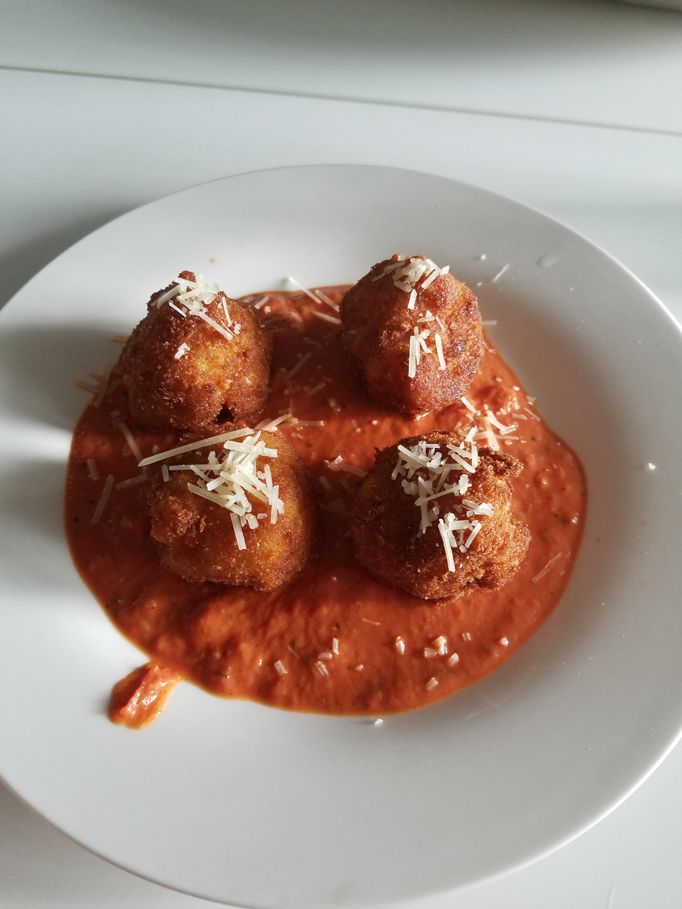

# Fried Macaroni and Cheese Balls

Theese delicious fried morsels packed with gooey cheese were inspired by The Cheese Cake Factory.

## Ingredients

__The Mac & Cheese:__

* 1/2 pound elbow macaroni
* 1 tablespoons unsalted butter
* 1 tablespoons all-purpose flour
* 1 cups milk
* 1/2 pound grated Cheddar
* 1/2 pound grated smoked Gouda
* Salt and freshly ground black pepper
* 1 large egg
* 1.5 cups seasoned bread crumbs
* Vegetable oil, for frying

__The Sauce:__

* 1/4 cup tomato sauce
* 2 teaspoons heavy whipping cream
* 1 tablespoon shredded parmesan

## Directions

Cook the macaroni according to package instructions. Drain and rinse with cold water to stop the cooking, then set aside.

In a saucepan, melt the butter over medium heat. Sprinkle the flour into the butter and stir it with a whisk. Cook for 2 minutes. Whisk the milk into the flour mixture, working out any lumps. Cook until the sauce thickens, about 2 minutes. Reduce heat to low, add the cheeses, and stir until melted and smooth, this may take a good bit of time. Season with salt and pepper to taste.

Fold the cheese sauce into macaroni then pour the mac and cheese into a shallow pan and refrigerate until cold, at least 2 hours.

Shape the cold mac and cheese into meatball-sized balls and place them onto a waxed paper-lined tray. Freeze the balls overnight.

Beat the egg in a shallow bowl. Put the bread crumbs into another shallow bowl. Remove the mac and cheese balls from the freezer. Dip the frozen balls into the egg wash then into the bread crumbs. Put the balls back into the freezer until you are ready to fry.

Heat the oil in a deep-fat fryer to 350 degrees F. Fry the mac and cheese balls until they are golden brown and center is hot, about 5 minutes. Serve hot with your favorite marinara or Alfredo sauce or combination or both for dipping.

While they are frying, but a small sauce pan on medium heat and combine the tomatoe sauce, heavy whipping cream, and parmesan. Still occasionally until the cheese is melted.

__tags:__ cheese, balls
